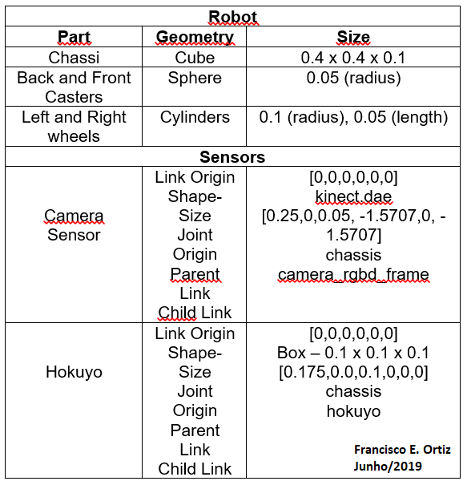

# Map My World Robot Project

### &copy; Francisco E. Ortiz 
### Junho/2019

## Abstract
The purpose of this project is to perform the localization and mapping simultaneously in a robot so that it can generate a map of its environment. The SLAM model used through Real-Time Appearance-based Mapping (RTAB-Map), through the RGB-D sensor (camera and depth sensor), a 1D scanner and odometer such as IMU and encoders are used. Wheel for all control. The robot is tele operated around the site to generate the 2D and 3D environment map for a custom environment of its own.

## Introduction
One of the most useful features for locating external information for a robot is through 2D or 3D mapping, allowing you to learn about the environment. The sensors allow the dynamic mapping in the recognition of obstacles and free areas, so that they can plan the path of their navigation trajectory. For mapping will be used RTAB-Map (Real Time Appearance Based Mapping) is used because it is a SLAM which makes use of RGB-D camera sensors and a range finder, using a loop detector based on appearance. The map stored in a database can be viewed through the RTABmap-database viewer.

## Background
The Simultaneous Location and Mapping methodology allows a robot to map where there is no map provided. The implementation algorithms include the Job Grid Mapping, Fast-SLAM and GraphSLAM, and the 3D Graph-based SLAM with RTAB-Mapping covered for the project.
The implementation of the SLAM algorithm has a certain degree of complexity in 3D, with possible amounts of noise, through the Odometry sensor which is used to follow the movement of the robot. SLAM also becomes challenging on parts of the map that look like another indoors and the large amount of memory required and additional memory management, but can be overcome with parameter settings becoming manageable.
###Mapping Algorithms
A custom particle filter approach used in the FastSLAM algorithm, which combines SLAM and localization. These hold the trajectory with the map characteristics estimated by Gaussian Local for the robot. For each of these characteristics, the Low-Extended Extended Kalman Filter (KFE) used to locate the robot and map the environment efficiently, but generating a problem, since it is necessary to have a reference point, rendering it incapable model an arbitrary environment.
The Graph-based SLAM solves the problem by retrieving the path and map using all the information recorded without the need for a predefined milestone, with benefits in accuracy and reduction of on-board processing. Due to adopting a graph-based representation poses, environmental characteristics, the corresponding probabilistic of motion and measurement constraints, thus attempts to solve the uncertainties of these probabilities in the map.
###RTAB-Mapping
The RTAB-Map is an RGB-D Graph-Based SLAM based on an incremental visual-based loop closure detector approach, which occurs when the Robot revisits a location and recognizes a characteristic or a reference point, re-adjusting the map accordingly, when the map is readjusted, the robot is solving the uncertainties of probability of its previous movements. The lock loop detector uses a bag-of-words to determine whether a possible new perception refers to the previous location that already visited or to a new location. When a close loop is accepted, a new chart constraint added to the visual chart of maps. Then a chart optimizer will minimize the error on the map. Loop termination occurs in real-time, so that as the map extended, a memory management approach applied to limit the number of locations used for loop closure detector and chart optimization, prioritizing constraints on real time.

##Configurations
###Robot Model Configuration
The robot complemented from the localization project and had its camera replaced by a front RGB-D camera as shown in Figure 1.

  

 Fig. 1: Robot Visual.  

###Model
The model developed in URDF format Table 1 shows the specifications.

  

 Tab. 1: Robot and Sensors Specifications.  

###Transform Frames
Figure 2 shows the Transform Frames for the robot links.

  

 Fig. 2: Transform Frames Links  

###Packages
The Figure 3 shows the structure used for project in ROS.

  

 Fig. 3: Structure used for project.  

###Scene Configuration
It was used a model created in the Gazebo composed of three environments and arranged objects in its interior shows Figure 4, so that the robot can apply the correct loop closures while mapping the area.

  

 Fig. 4: Personal Environment. 

## Results
### Mapping
The results of the 2D and 3D mapping process shows in Figure 5 and 6, and the repetition of the robot motion must be repeated in the environment for a better result or better configurations. 

  

 Fig. 5: Mapped environment with loop closures constraints 

  

 Fig. 6: Mapped environment with loop closures scenes. 

## Discusion
### Mapping
The performance of mapping the robot was reasonable when mapping regions with little space, several errors occurred. This was because the robot was erroneously driven toward the wall due to the slow processing speed of the computer, fell and rolled, but the generated map obtained 172 loop closures. The result can be visualized in Figures 5 of 6 in the formation of the map for the closure loop. They were changed for better performance due to the locking of the robot the values Kp/MaxFeatures for 200 and the Vis/MinInliers for 10.

## Future Work
Mapping for environment recognition is a critical point in robotic applications as they are used in many industry sectors. For this work, the correct encodings were performed so that the nodes communicate correctly in the environment: Teleop, RTAB-Map and perform the 2D and 3D mapping with the RTAB-Map. Additional enhancements include improved parameterization to be able to recognize loop closures, and later deployment in a field robot.
